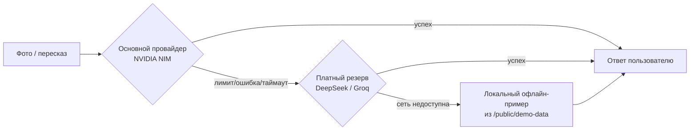

# Архитектура — «Эхо» на Vercel, бюджет $10

## Стек

- **Next.js (App Router) + TypeScript + Tailwind CSS** — фронтенд и серверные API-роуты в
  одном репозитории, идеальный формат для Vercel и для того, как работает Claude Code.
- **Vercel Hobby (бесплатный план)** — хостинг. Свой поддомен `*.vercel.app` даётся сразу,
  покупать домен не нужно. Ограничения плана — только некоммерческое личное использование,
  школьный проект под это подходит без вопросов.
- **PWA** (`manifest.json` + service worker, например через `next-pwa` или ручной минимальный
  service worker) — устанавливается на экран телефона, часть офлайн-контента доступна без сети.
- **Neon Postgres** (бесплатный тариф, подключается командой `vercel install neon`) — хранит
  историю параграфов и результаты для экрана «Прогресс» и для агрегированной статистики пилота.
- **Upstash Redis** (бесплатный тариф, `vercel install upstash`) — кэш ответов нейросети и
  ограничение частоты запросов (rate limit), чтобы не вылететь за бесплатные лимиты и не
  потратить бюджет впустую.

## Все внешние вызовы — только с сервера

Ключи от нейросетей никогда не должны попадать в код, который выполняется в браузере.
Каждый вызов идёт через собственный API-роут Next.js (`/app/api/.../route.ts`), а ключ
лежит в переменных окружения Vercel — так его никто не увидит, открыв код страницы.

## Задачи и провайдеры

| Задача | Основной вариант | Цена | Запасной вариант | Когда переключаться |
|---|---|---|---|---|
| Прочитать фото страницы | NVIDIA NIM, vision-модель (например, из семейства Nemotron VL) | бесплатно, 40 запросов/мин | Tesseract.js (офлайн, бесплатно) как чистое распознавание текста, если фото плохого качества или лимит исчерпан | автоматически при ошибке/таймауте основного |
| Упростить и объяснить «как другу» | NVIDIA NIM (DeepSeek V3.2 / Qwen) | бесплатно | DeepSeek API напрямую | если лимит 40 запросов/мин исчерпан во время пилота на классе |
| Сравнить пересказ с оригиналом | тот же вызов, что и выше, другой промпт | бесплатно | тот же fallback, что выше | — |
| Прочитать вслух (TTS) | Web Speech API (браузер) | $0 | — (не нужен, работает у 95%+ устройств) | — |
| Записать и распознать пересказ (STT) | Web Speech API (браузер) — для повседневного пилота | $0 | Groq Whisper API — для демо-режима на самой защите, где точность важнее всего | сознательно переключать вручную на защите, не тратить бюджет на весь пилот |
| Кэш и защита от перерасхода | Upstash Redis + `@upstash/ratelimit` | бесплатно | — | — |
| История и статистика | Neon Postgres | бесплатно | — | — |

## Бюджет $10 — как расходуется

| Статья | Оценка | Комментарий |
|---|---|---|
| NVIDIA NIM (вся логика ИИ) | $0 | бесплатный тариф, 40 запросов/мин достаточно для класса |
| Web Speech API (TTS+STT) | $0 | встроено в браузер |
| Neon + Upstash | $0 | бесплатные тарифы с большим запасом на объём одного класса |
| DeepSeek API (резерв на случай превышения лимита NIM) | $3–4 | ≈$0.14 за 1 млн входных токенов — этого хватит на тысячи запросов |
| Groq Whisper (только для качественной записи в день защиты) | $1 | ≈$0.04 за час аудио |
| **Буфер на непредвиденное** | **$5** | на случай скачка нагрузки в день защиты или смены тарифов у провайдера |

Цены у ИИ-провайдеров меняются часто — перед стартом стоит свериться с их официальными
страницами и обновить цифры в этом файле.

## Схема отказоустойчивости



Ни один экран не должен показывать пользователю голую техническую ошибку. Каждый уровень
фоллбэка — это заранее продуманный, дружелюбно оформленный запасной путь.

## Ключи, которые нужно получить руками (все бесплатно)

1. **NVIDIA NIM** — зарегистрироваться на build.nvidia.com, выпустить API-ключ.
2. **DeepSeek** — платный резерв, привязать карту, пополнить на пару долларов из бюджета.
3. **Groq** — зарегистрироваться на console.groq.com, выпустить API-ключ.
4. **Neon** и **Upstash** — подключаются прямо из терминала Vercel командами
   `vercel install neon` и `vercel install upstash`, ключи прописываются автоматически.

## Переменные окружения (Vercel → Settings → Environment Variables)

```
NVIDIA_NIM_API_KEY=
DEEPSEEK_API_KEY=
GROQ_API_KEY=
DATABASE_URL=          # подставится автоматически после vercel install neon
KV_REST_API_URL=       # подставится автоматически после vercel install upstash
KV_REST_API_TOKEN=
```

## Деплой

1. Репозиторий на GitHub → Vercel → Import Project → выбрать репозиторий → Deploy.
2. Каждый `git push` в основную ветку автоматически пересобирает сайт — типичный цикл
   вайб-кодинга: Claude Code пишет код → коммит и пуш → через ~минуту изменения уже на сайте.
3. Адрес вида `echo-trainer.vercel.app` выдаётся сразу, без дополнительных действий.
